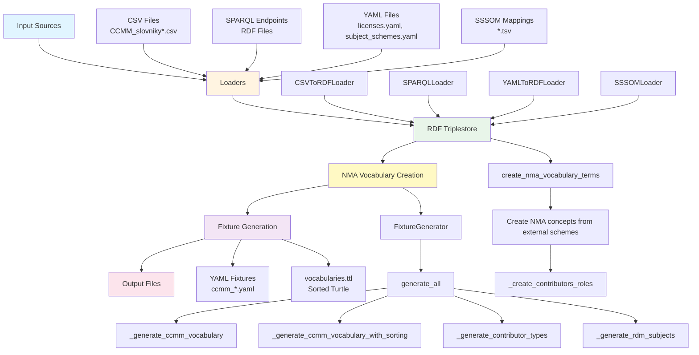
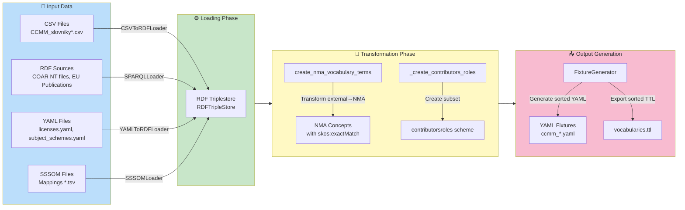
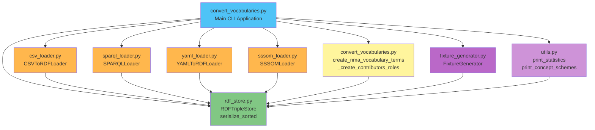
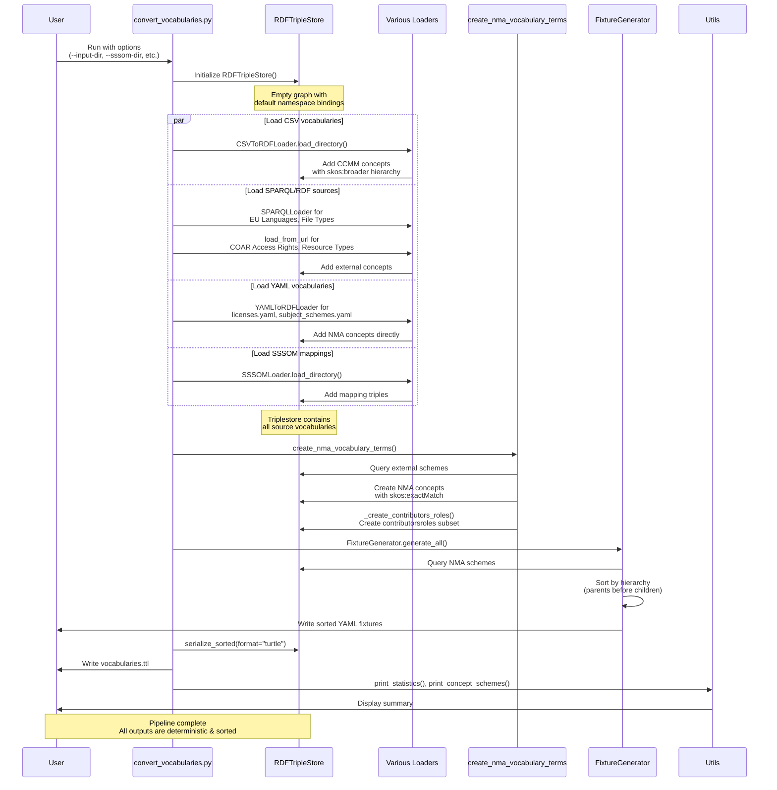

# Architecture Diagram

## System Overview



## Data Flow



## Module Dependencies



## RDF Data Model

```mermaid
graph LR
    subgraph ExternalSources["External Vocabulary Sources"]
        CCMM[CCMM CSV<br/>vocabs.ccmm.cz]
        COAR[COAR RDF<br/>purl.org/coar]
        EU[EU Publications<br/>publications.europa.eu]
    end
    
    subgraph NMAScheme["NMA Vocabulary Scheme"]
        NMA[NMA Concepts<br/>nma.eosc.cz/vocabularies]
        NMA --> |skos:inScheme| NMAScheme[ConceptScheme]
        NMA --> |dc:identifier| ID[Identifier<br/>lowercase]
        NMA --> |skos:prefLabel| LabelCS[Label@cs]
        NMA --> |skos:prefLabel| LabelEN[Label@en]
        NMA --> |skos:definition| DefCS[Definition@cs]
        NMA --> |skos:definition| DefEN[Definition@en]
        NMA --> |skos:broader| Parent[Parent Concept<br/>within NMA scheme]
    end
    
    subgraph Relationships["Cross-Scheme Relationships"]
        NMA --> |skos:exactMatch| CCMM
        NMA --> |skos:exactMatch| COAR
        NMA --> |skos:exactMatch| EU
        NMA --> |skos:broadMatch| ExternalBroad[External Concepts]
    end
    
    subgraph SpecialCases["Special NMA Schemes"]
        Contributors[contributorsroles<br/>subset of AgentRole]
        Subjects[subjects<br/>for Invenio RDM]
    end
    
    style CCMM fill:#ffe0b2
    style COAR fill:#ffe0b2
    style EU fill:#ffe0b2
    style NMA fill:#a5d6a7
    style NMAScheme fill:#4fc3f7
    style Relationships fill:#fff59d
    style SpecialCases fill:#ce93d8
```

## Conversion Pipeline



## Key Design Decisions

### 1. Two-Phase Processing
- **Loading Phase**: All source data (CSV, RDF, YAML, SSSOM) is loaded into a single RDF triplestore
- **Transformation Phase**: External concepts are transformed to NMA scheme with proper mappings
- **Generation Phase**: Fixtures are generated from the unified triplestore

### 2. NMA Vocabulary Creation
The `create_nma_vocabulary_terms()` function:
- Queries each external scheme (COAR, EU Publications, CCMM)
- Creates corresponding NMA concepts with lowercase IDs
- Preserves all properties (labels, definitions, hierarchies)
- Adds `skos:exactMatch` to original external concepts
- Handles special cases like `contributorsroles` (subset of AgentRole)

### 3. Deterministic Output
- YAML fixtures: Sorted by ID, keys sorted alphabetically
- Turtle file: Uses `ttlser.DeterministicTurtleSerializer` for stable output
- Enables reliable Git diffs and reproducible builds

### 4. Hierarchy Preservation
- CSV loader creates `skos:broader` relationships using `parentId` column
- YAML loader converts parent IDs to lowercase for consistency
- Fixture generator respects hierarchy when sorting output

### 5. Namespace Handling
- External URIs preserved in `skos:exactMatch` relationships
- NMA IRIs use standardized format: `https://nma.eosc.cz/vocabularies/{type}/{id}`
- Lowercase IDs ensure consistency across all outputs
